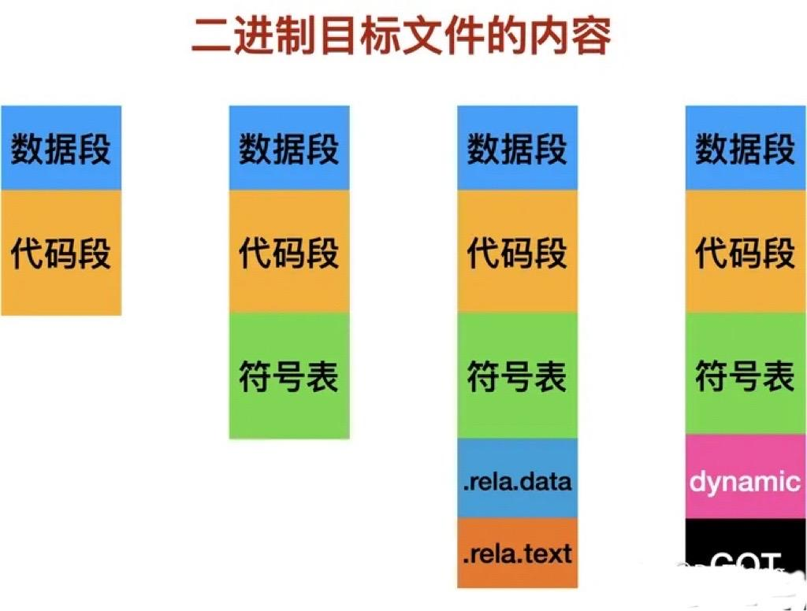
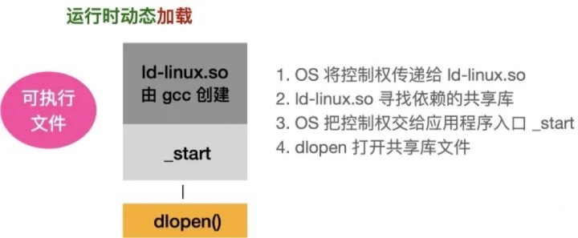

# 编译流程


编译可细分为：预编译、编译、汇编、链接四个阶段。

## 1. 预处理（Pre-process）

```shell
gcc -E main.c -o main.i
```

完成的事情：

1. 删除所有的 “#define”，并展开所有的**宏定义**；
2. 处理所有的**条件预编译指令**，“#if”、“#ifdef”、“#endif” 等；
3. 处理 **“#include” 预编译指令**，将被包含的文件**插入到预编译指令所在的文件**；
4. **删除所有的注释**；
5. **添加行号和文件名标识**，以便于编译器产生调试用的符号信息及纠正错误和警告时显示行号；
6. 保留所有的 **#pragma 编译器指令**，编译时需要使用。

## 2. 编译（compilation）

```shell
gcc -S main.i
# 生成main.s文件
```

完成的事情：

1. 将源码**转成汇编**指令；
2. 进行词**法、语法、语义的解析**；
3. **代码优化**；
4. **汇总符号** {[数据（全局、静态变量）、函数] 会生成符号}；

## 3. 汇编（assembly）

```shell
gcc -c main.s
# 生成main.o文件 —— 可重定位的二进制目标文件
```

完成的事情：

1. 将汇编指令**翻译成二进制**格式；
2. **生成各个 section**（段）；
3. 生成**符号表**；

产生二进制 *.o 文件，可以使用objdump、readelf 工具查看。

## 4. 链接（Link）

```shell
gcc main.o -o main

# 也可以直接从源码编译链接
gcc main.c -o main
```

完成的事情：

1. **合并**所有文件的各个 section，调整段的大小及段的起始位置。**合并符号表**，进行符号解析，并给符号**分配一个虚拟地址**；
2. 进行**符号重定位**，在使用符号的地方，全部替换成符号的虚拟地址；


# 链接的原理

## 1. 单个源文件编译

单个文件可以被编译成目标文件，二进制目标文件中的section很多，下图列出了比较常见的段。



### 1.1 符号表的作用是什么

1. 记录该目标文件中**定义**的**全局变量和函数**；
2. 记录该目标文件中**引用**的**全局变量和函数**；


### 1.2 .rela.* 的作用是什么

全称 relocation（重定位），记录编译器在编译时不确定的符号地址——针对**引用的外部符号**。

dynamic 段中保存可执行文件依赖哪些动态库。

GOT 段记录需要引用的外部符号地址。

> GOT怎么直到外部符号地址？？.rela.*中不是说引用的外部符号地址不确定吗？？？
>
> 这部分分析见[重定位]()

## 2. 编译期链接

多个 .o 文件可以通过链接器（ld）被打包在一起，组合成库文件。库文件又分为静态库（.a 文件）和共享库( .so 文件)。

什么是ld呢？它本身也是可执行文件，属于GNU的一部分，将一堆目标文件通过符号表链接成最终的目标文件、库文件和可执行文件。

> GNU 还需要看！

### 2.1 *.a 文件如何生成

ld 直接将涉及的所有目标文件打包进静态库文件

### 2.2 *.so 文件如何生成

在**链接生成共享库**文件的过程中，并不拷贝目标文件中涉及的代码段，只记录它需要**引用的外部符号位置**（在哪些目标文件中）。

所有的目标文件、库文件和可执行文件都有统一的格式，即 ELF，Executable and Linking Format（可执行链接格式）。

> 此处的 ELF 和 操作系统中的elf文件有区别吗？


libstdc++.so 是标准库文件。

## 3. 程序运行期

如果可执行文件没有用到共享库，那么该程序就可以独立运行，因为它内部所有的符号都有对应的二进制码。

度过可执行文件用到共享库，运行时需要使用共享库的代码且对应的两种使用方式，分别是运行时动态**链接**和运行时动态**加载**。

### 3.1 可执行文件的组成


ld-linux.so：不是可执行程序，只是一个shell脚本。作为解释器，写在 elf 文件中，ld-linux.so 先于 main 函数工作，用于查找主程序所依赖的共享库，实际上可以直接执行 ld-linux.so。



### 3.2 为什么这里使用解释器呢

解释器的特点是动态特性和可移植性，比如在解释器执行时可动态改变变量类型，对程序进行修改以及在程序中插入良好的调试诊断信息等。而将解释器移植到不同的系统上，则程序不用改动就可以在移植了解释器的系统上运行。同时解释器也有很大的缺点，如执行效率低、占用空间大，因为不仅要给用户程序分配空间，解释器本身也占用了宝贵的系统资源。

### 3.3 动态链接和动态加载的区别

动态链接和动态加载都是在程序运行时发生，并将所需代码拷贝到内存中。

关键区别是：

- 动态链接的流程是：OS直接把共享库代码拷贝到内存，通过动态链接方式拷贝到内存的库代码可以在各个进程之间共享。
- 动态加载由人工指定（代码中的 dlopen() 接口），可以在各自进程中打开共享库代码。

> 这里还是没懂？？OS是怎么拷贝的？怎么实现人工指定？？
>
> - 动态加载类似于插件，在动态加载发生之前可以实际执行，硬盘上存储了已经生成好的目标模块，这个目标模块是由需要子程序组成，在使用到相应子程序时再把其加载到内存中使用。
>
> - 动态链接不是将加载延迟到执行时，而是将链接延迟到执行时。磁盘上存储着目标模块中包含着一部分它还没未链接的模块。动态加载的模块是经过链接之后的，也就是该模块已经结合了所有它会用到的模块，只是在你程序的不同地方使用。
>
> 其他的理解
>
> - 动态加载是在运行时把一个 library 或者二进制文件调入内存，取出其中的 functions 或者 variables 来使用。
> - 动态链接不止是动态加载，还有链接的工作。
>
> 通俗一点的理解（并不准确）
>
> - 动态加载类似于直接调用一个可执行文件（插件）
> - 动态链接是把代码链接进来，然后再执行。

动态链接的实现是依赖于存根（stub）的，目标模块中在使用需要动态链接的模块的地方使用存根来代替，存根能够指出如何装入以及装入后的程序在内存的哪。
